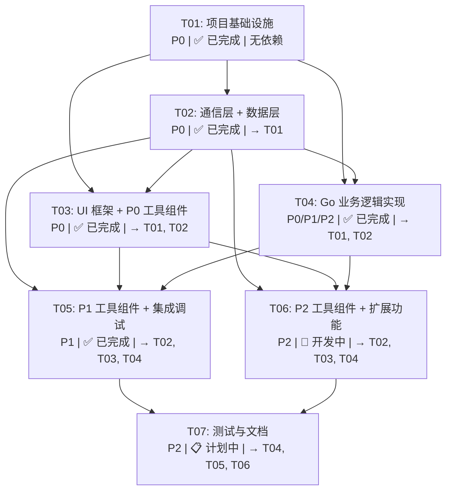

# DevTools 开发常用小工具集 — 系统架构设计文档

> **项目**: dev_tools — 开发常用小工具集桌面应用
> **架构师**: Bob
> **日期**: 2025-07-03
> **版本**: v2.0 (Wails v2 架构更新)
> **架构变更**: 从 Tauri v2 + Go sidecar 迁移至 Wails v2 单进程架构

---

## Part A: 系统设计

### 1. 实现方案与框架选型

#### 1.1 核心技术挑战

| 挑战 | 说明 | 解决策略 |
|------|------|----------|
| Go 与桌面框架集成 | 需要将 Go 业务逻辑暴露给前端 UI | 采用 **Wails v2** 单进程架构：Go 方法直接绑定到前端，无需 sidecar 进程，简化部署与通信 |
| Windows 便携分发 | 默认 Wails 生成安装包，需解压即用 | 自定义打包脚本，将 Wails exe + 前端资源打包为 zip，数据目录使用 `{exe}/data/`，实现零安装便携 |
| 即时响应交互 | 输入即输出，毫秒级响应 | Wails 直接绑定 Go 方法，通过 WebSocket 通信，无进程启动开销，响应延迟 < 50ms |
| Base64 文件编解码 | 文件拖拽上传需流式处理 | Go 后端处理文件 I/O，前端仅传递文件路径，Go 侧设置 10MB 上限 |
| Cron 表达式解析 | 5 位标准 + 6 位秒级扩展 | 使用 Go cron 库同时支持两种格式，返回下次执行时间列表 |
| 工具扩展性 | 需支持 12+ 种工具且易于扩展 | 通用组件库 + 工具服务层独立封装，新增工具仅需添加 `*_service.go` 和对应前端组件 |

#### 1.2 Go + Wails v2 集成方案：单进程直接绑定

**选定方案**: Wails v2 单进程架构，Go 方法直接绑定到前端 JavaScript。

**方案对比与选择理由**:

| 方案 | 便携性 | 响应速度 | 复杂度 | 官方支持 | 选择 |
|------|--------|----------|--------|----------|------|
| **A: Wails v2 单进程** | ✅ 单二进制打包 | ✅ 直接绑定，无 IPC 开销 | 低 | ✅ 官方推荐 | **✅ 选用** |
| B: Tauri v2 + Go sidecar | ✅ | ⚠️ 进程间通信开销 | 高 | ❌ 第三方桥接 | ❌ |
| C: Electron + Go | ❌ 包体积大 | ✅ | 高 | ❌ 资源占用高 | ❌ |

**通信机制**: Wails 绑定 + WebSocket
```
前端 invoke → Wails Runtime → Go 方法调用 → 返回结果 → 前端接收
```

**Wails 应用生命周期**:
1. 用户双击 exe → `main.go` 的 `main()` 启动应用
2. Wails 初始化 WebView2 前端 → 加载前端资源
3. `app.startup()` 初始化 → 创建便携数据目录 `{exe}/data/`
4. 前端通过 `invoke('Method', args)` 调用 Go 方法 → Wails 自动路由到对应 Go 方法
5. Go 方法返回结果 → 前端接收并更新 UI
6. 用户关闭窗口 → `app.shutdown()` 清理 → 应用退出

#### 1.3 前端框架选型

| 层面 | 选型 | 理由 |
|------|------|------|
| UI 框架 | React 18 | PRD 已确定，生态成熟，Wails 官方支持 |
| 构建工具 | Vite 5 | Wails v2 默认集成，开发体验极佳，支持热更新 |
| 样式方案 | Tailwind CSS 3 | PRD 已确定，原子化 CSS 适合工具类 UI |
| 组件基础 | Radix UI Primitives | 无样式、可访问的原语组件（Dialog/Tooltip/Toggle/Select），配合 Tailwind 定制 |
| 状态管理 | Zustand | 轻量、无 boilerplate，适合工具类应用的简单状态 |
| 路径别名 | @ → src/ | Vite + tsconfig 路径别名，开发便捷 |

**不选用 MUI/Ant Design 的理由**: 开发者工具类应用追求轻量与定制感，Radix + Tailwind 可完全自定义样式，包体积更小，视觉风格更贴合 VS Code 式开发者工具审美。

#### 1.4 项目构建与打包方案

**开发模式**:
```bash
# 1. 安装 Wails CLI (首次)
go install github.com/wailsapp/wails/v2/cmd/wails@latest

# 2. 安装前端依赖 (首次)
cd frontend && npm install && cd ..

# 3. 启动 Wails 开发服务（自动启动前端 Vite dev server + 前后端热更新）
wails dev
```

**生产构建（Windows 便携版）**:
```bash
# 1. 构建生产版本
wails build

# 2. 运行便携打包脚本
./scripts/build-portable.sh
# 产物: dist/dev-tools-win64-portable.zip
```

**便携版关键技术点**:
- Wails 自动生成单个 exe 文件，前端资源内嵌
- Windows 10/11 已自带 WebView2 runtime，无需额外安装
- 数据目录使用 `{exe所在目录}/data/` 而非系统 AppData，确保便携性
- 自定义打包脚本将 exe 打包为 zip，解压即用
- 不写注册表，无系统依赖

---

### 2. 文件列表（相对路径）

```
dev-tools/
├── .gitignore
├── wails.json                                 # Wails v2 配置（窗口、绑定、打包）
├── go.mod                                     # Go 模块声明
├── go.sum                                     # Go 依赖锁定
├── main.go                                    # Wails 应用入口
├── app.go                                     # App 结构体 + Wails 绑定方法
├── models.go                                  # 数据模型定义（ToolMeta, TimezoneResult 等）
├── *.service.go                               # 各工具服务层（json_service.go, base64_service.go 等）
│
├── scripts/
│   ├── build-all.sh                           # 全量构建 + 便携打包脚本
│   ├── build-go.sh                           # Go 编译脚本（备用，Wails 自动处理）
│   └── dev.sh                                # 开发环境启动脚本
│
├── frontend/                                  # React 前端源码
│   ├── index.html                             # Vite 入口 HTML
│   ├── package.json                           # 前端 npm 依赖声明
│   ├── vite.config.ts                         # Vite 构建配置
│   ├── tsconfig.json                          # TypeScript 配置
│   ├── tailwind.config.ts                     # Tailwind CSS 配置
│   ├── postcss.config.js                      # PostCSS 配置
│   ├── src/
│   │   ├── main.tsx                           # React 入口挂载
│   │   ├── App.tsx                            # 根组件（路由 + 布局编排）
│   │   ├── vite-env.d.ts                      # Vite 类型声明
│   │   ├── types/
│   │   │   ├── wails.ts                       # Wails 生成的类型定义（工具方法签名）
│   │   │   ├── tool.ts                        # 工具类型定义（ToolId, ToolMeta, ToolAction）
│   │   │   └── command.ts                     # 命令请求/响应类型（与 Go 对齐）
│   │   ├── store/
│   │   │   ├── toolStore.ts                   # Zustand: 当前选中工具 + 输入输出状态
│   │   │   ├── historyStore.ts                # Zustand: 操作历史记录
│   │   │   └── themeStore.ts                  # Zustand: 主题状态（亮/暗）
│   │   ├── hooks/
│   │   │   ├── useToolCommand.ts              # 封装 Wails invoke 调用 Go 方法
│   │   │   ├── useClipboard.ts                # 剪贴板复制 hook
│   │   │   └── useToolHistory.ts              # 操作历史记录 hook
│   │   ├── utils/
│   │   │   ├── constants.ts                   # 常量定义（工具列表、时区选项、Cron 预设等）
│   │   │   ├── wailsApi.ts                    # Wails 方法调用封装（生成于 go generate）
│   │   │   └── format.ts                      # 前端格式化辅助（缩进、语法高亮标记）
│   │   ├── styles/
│   │   │   ├── globals.css                    # 全局样式 + Tailwind directives
│   │   │   └── sidebar.css                    # 侧边栏特定样式
│   │   ├── components/
│   │   │   ├── layout/
│   │   │   │   ├── AppLayout.tsx              # 整体布局（侧边栏 + 内容区 + 状态栏）
│   │   │   │   ├── Sidebar.tsx                # 左侧导航侧边栏（工具列表 + 搜索 + 折叠）
│   │   │   │   ├── MainContent.tsx            # 右侧主内容区（渲染当前工具组件）
│   │   │   │   └── StatusBar.tsx              # 底部状态栏（工具名 + 操作提示）
│   │   │   ├── common/
│   │   │   │   ├── InputArea.tsx              # 通用输入区组件（文本框模式）
│   │   │   │   ├── FileDropArea.tsx           # 文件拖拽输入区（Base64 文件模式）
│   │   │   │   ├── OutputArea.tsx             # 通用输出区组件（结果展示 + 复制按钮）
│   │   │   │   ├── ActionBar.tsx              # 操作按钮行组件
│   │   │   │   ├── ErrorDisplay.tsx           # 错误信息展示组件（行号高亮）
│   │   │   │   └── CopyButton.tsx             # 一键复制按钮
│   │   │   └── tools/
│   │   │       ├── JsonTool.tsx               # JSON 格式化工具页面
│   │   │       ├── Base64Tool.tsx             # Base64 编解码工具页面
│   │   │       ├── TimestampTool.tsx          # 时间戳转换工具页面
│   │   │       ├── YamlTool.tsx               # YAML 格式化工具页面
│   │   │       ├── XmlTool.tsx                # XML 格式化工具页面
│   │   │       ├── RandomTool.tsx             # 随机字符串生成工具页面
│   │   │       ├── CronTool.tsx               # Cron 表达式解析工具页面
│   │   │       ├── UrlTool.tsx                # URL 编解码工具页面
│   │   │       ├── HashTool.tsx               # Hash 摘要工具页面
│   │   │       ├── JwtTool.tsx                # JWT 解析工具页面
│   │   │       ├── UuidTool.tsx               # UUID 工具页面
│   │   │       └── RegexTool.tsx              # 正则测试工具页面
│   │   └── wailsjs/                           # Wails 生成的绑定代码（wails generate）
│   │       ├── runtime/
│   │       └── go/
│   │
├── pkg/                                        # Go 业务逻辑包
│   ├── common/
│   │   └── common.go                          # 通用常量与工具函数
│   ├── jsonutil/
│   │   ├── jsonutil.go                        # JSON 操作：Format, Minify, Validate
│   │   └── jsonutil_test.go                   # JSON 单元测试
│   ├── base64util/
│   │   ├── base64util.go                      # Base64 操作：EncodeText, DecodeText, EncodeFile, DecodeFile
│   │   ├── fileutil.go                        # 文件 I/O 辅助（10MB 限制检查）
│   │   └── base64util_test.go                 # Base64 单元测试
│   ├── timeutil/
│   │   ├── timeutil.go                        # 时间戳转换：TimestampToDate, DateToTimestamp, MultiTimezone
│   │   └── timeutil_test.go                   # 时间戳单元测试
│   ├── yamlutil/
│   │   ├── yamlutil.go                        # YAML 操作：Format, Validate, ToJSON
│   │   └── yamlutil_test.go                   # YAML 单元测试
│   ├── xmlutil/
│   │   ├── xmlutil.go                         # XML 操作：Format, Minify, Validate
│   │   └── xmlutil_test.go                    # XML 单元测试
│   ├── randomutil/
│   │   └── randomutil.go                      # 随机字符串生成：Generate, GenerateBatch
│   ├── cronutil/
│   │   └── cronutil.go                        # Cron 解析：Parse, Validate, NextN
│   ├── urlutil/
│   │   └── urlutil.go                         # URL 编解码：Encode, Decode, ParseQuery
│   ├── hashutil/
│   │   ├── hashutil.go                        # Hash 摘要：GenerateMD5, GenerateSHA1, GenerateSHA256, GenerateSHA512
│   │   └── hashutil_test.go                   # Hash 单元测试
│   ├── jwtutil/
│   │   ├── jwtutil.go                         # JWT 解析：Decode, Validate
│   │   └── jwtutil_test.go                    # JWT 单元测试
│   ├── uuidutil/
│   │   ├── uuidutil.go                        # UUID 操作：Generate, Validate
│   │   └── uuidutil_test.go                   # UUID 单元测试
│   └── regexutil/
│   │   ├── regexutil.go                       # 正则测试：Test, Replace
│   │   └── regexutil_test.go                  # 正则单元测试
│
├── internal/                                   # Go 内部包（非导出）
│   └── ...                                     # 预留内部实现
│
├── docs/
│   ├── architecture.md                         # 本架构设计文档
│   ├── sequence-diagram.mermaid                # 程序调用时序图
│   ├── class-diagram.mermaid                   # 数据结构与接口类图
│   └── prd.md                                  # 产品需求文档
│
├── dist/                                       # 构建输出目录（便携版 zip）
│   └── dev-tools-win64-portable.zip
│
├── build/                                      # Wails 临时构建目录
└── ...                                         # 其他文件
```

---

### 3. 数据结构与接口（类图）

> 详细 Mermaid 类图见 `docs/class-diagram.mermaid`

#### 3.1 Wails 绑定方法接口

Wails 自动将 Go 结构体方法绑定到前端，以下是核心接口定义：

```go
// App 是主应用结构体，所有工具方法绑定到此结构体
type App struct {
    ctx context.Context
}

// 通用方法
func (a *App) startup(ctx context.Context)                  // 应用启动初始化
func (a *App) shutdown()                                     // 应用关闭清理
func (a *App) ClipboardWrite(text string) error              // 剪贴板写入
func (a *App) GetDataDir() string                            // 获取便携数据目录
func (a *App) GetToolList() []ToolMeta                       // 获取工具列表
func (a *App) GetAppVersion() string                         // 获取应用版本

// JSON 工具方法
func (a *App) FormatJSON(input string, indent int) (string, error)
func (a *App) MinifyJSON(input string) (string, error)
func (a *App) ValidateJSON(input string) error

// Base64 工具方法
func (a *App) EncodeBase64Text(input string) (string, error)
func (a *App) DecodeBase64Text(input string) (string, error)
func (a *App) EncodeBase64File(filePath string) (string, error)
func (a *App) DecodeBase64File(encoded string, outputPath string) error

// 时间戳工具方法
func (a *App) TimestampToDate(timestamp int64, unit string, timezone string) (string, error)
func (a *App) DateToTimestamp(dateStr string, timezone string) (int64, error)
func (a *App) MultiTimezone(timestamp int64, unit string) ([]TimezoneResult, error)

// YAML 工具方法
func (a *App) FormatYAML(input string, indent int) (string, error)
func (a *App) ValidateYAML(input string) error
func (a *App) YamlToJSON(input string) (string, error)

// XML 工具方法
func (a *App) FormatXML(input string, indent int) (string, error)
func (a *App) MinifyXML(input string) (string, error)
func (a *App) ValidateXML(input string) error

// 随机字符串方法
func (a *App) GenerateRandom(length int, charset map[string]bool) (string, error)

// Cron 工具方法
func (a *App) ParseCron(expression string, nextCount int, extended bool) (string, error)
func (a *App) ValidateCron(expression string, extended bool) error
func (a *App) GetCronNextN(expression string, count int, extended bool) ([]string, error)

// URL 工具方法
func (a *App) EncodeURL(input string) (string, error)
func (a *App) DecodeURL(input string) (string, error)
func (a *App) ParseURLQuery(input string) (map[string]string, error)

// Hash 工具方法
func (a *App) GenerateHash(input string, algorithm string) (string, error)
func (a *App) GenerateAllHash(input string) (map[string]string, error)

// JWT 工具方法
func (a *App) DecodeJWT(token string) (map[string]interface{}, error)

// UUID 工具方法
func (a *App) GenerateUUID() (string, error)
func (a *App) ValidateUUID(uuid string) error

// 正则测试方法
func (a *App) TestRegex(pattern string, text string) (string, error)
func (a *App) ReplaceRegex(pattern string, text string, replacement string) (string, error)
```

#### 3.2 数据模型定义

```go
// ToolMeta 工具元信息
type ToolMeta struct {
    ID       string       `json:"id"`       // 工具标识符: "json", "base64", "timestamp", etc.
    Name     string       `json:"name"`     // 工具显示名称
    Icon     string       `json:"icon"`     // 工具图标（emoji 或文本）
    Category ToolCategory `json:"category"` // 工具分类: core, extended
    Actions  []ActionDef  `json:"actions"`  // 支持的操作列表
}

// ActionDef 操作定义
type ActionDef struct {
    Action string `json:"action"` // 操作标识: "format", "minify", "validate", etc.
    Label  string `json:"label"`  // 操作显示名称
}

// ToolCategory 工具分类
type ToolCategory string

const (
    ToolCategoryCore     ToolCategory = "core"     // 核心工具（P0）
    ToolCategoryExtended ToolCategory = "extended" // 扩展工具（P1/P2）
)

// TimezoneResult 时区转换结果
type TimezoneResult struct {
    Zone    string `json:"zone"`    // 时区名称: "Asia/Shanghai"
    DateStr string `json:"dateStr"` // 格式化日期字符串
    Offset  string `json:"offset"`  // 时区偏移: "+08:00"
}
```

#### 3.3 前端类型定义

```typescript
// 工具元信息
interface ToolMeta {
  id: ToolId;
  name: string;
  icon: string;
  category: 'core' | 'extended';
  actions: ActionDef[];
}

// 工具标识符类型
type ToolId = 'json' | 'base64' | 'timestamp' | 'yaml' | 'xml' | 'random' | 'cron' | 'url' | 'hash' | 'jwt' | 'uuid' | 'regex';

// 操作定义
interface ActionDef {
  action: string;
  label: string;
}

// 时区转换结果
interface TimezoneResult {
  zone: string;
  dateStr: string;
  offset: string;
}

// JWT 解析结果
interface JWTDecodeResult {
  header: Record<string, unknown>;
  payload: Record<string, unknown>;
  signature: string;
  valid: boolean;
  error?: string;
}

// Hash 生成结果
interface HashResult {
  md5?: string;
  sha1?: string;
  sha256?: string;
  sha512?: string;
}
```

---

### 4. 程序调用流程（时序图）

> 详细 Mermaid 时序图见 `docs/sequence-diagram.mermaid`

#### 4.1 应用启动流程

```
用户双击 exe → main.go main() 函数启动
    → Wails 初始化 WebView2 加载前端资源
    → 调用 app.startup(ctx) 初始化
    → 创建便携数据目录 {exe}/data/
    → 前端 React 渲染 AppLayout + Sidebar
    → 调用 GetToolList() 获取工具列表（从 app.ToolList 静态定义）
    → Sidebar 展示 15 个工具（3 个核心 + 12 个扩展）
```

#### 4.2 工具操作典型流程（以 JSON 格式化为例）

```
用户粘贴 JSON → InputArea onChange → toolStore.setInput()
用户点击[格式化] → JsonTool 调用 FormatJSON(input, indent)
    → Wails runtime 路由到 Go app.FormatJSON() 方法
    → Go 调用 pkg/jsonutil.Format(input, indent)
    → 返回格式化结果字符串到前端
    → useToolCommand 收到 result → toolStore.setOutput(result)
    → OutputArea 渲染格式化结果
    → CopyButton 可点击复制到剪贴板（调用 ClipboardWrite）
```

#### 4.3 Base64 文件编解码流程

```
用户拖拽文件 → FileDropArea onDrop → 获取文件路径
用户点击[编码] → Base64Tool 调用 EncodeBase64File(filePath)
    → Wails 路由到 Go app.EncodeBase64File()
    → Go base64util.EncodeFile(path) → 检查 10MB 限制 → 读取文件 → Base64 编码
    → 返回编码结果字符串 → 前端 OutputArea 展示
    → 用户点击[下载] → 前端处理下载逻辑
```

#### 4.4 Cron 表达式解析流程

```
用户输入 Cron 表达式 → 输入框 onChange → toolStore.setInput()
用户选择预设模板 → CronTool 更新输入框
用户点击[解析] → CronTool 调用 ParseCron(expression, 5, false)
    → Wails 路由到 Go app.ParseCron()
    → Go cronutil.Parse() → 解析表达式含义
    → 返回描述字符串 → 前端 OutputArea 展示
用户点击[下次执行] → CronTool 调用 GetCronNextN(expression, 5, false)
    → Go cronutil.NextN() → 计算下次 5 次执行时间
    → 返回时间列表 → 前端以表格形式展示
```

#### 4.5 应用关闭流程

```
用户关闭窗口 → Wails 检测到窗口关闭事件
    → 调用 app.shutdown()
    → 清理资源（如有）
    → Wails 终止 WebView2 进程
    → Go 程序退出
```

---

### 5. 待明确事项（UNCLEAR）

| # | 事项 | 当前决策 | 备注 |
|---|------|----------|------|
| 1 | ~~架构选择：Tauri v2 vs Wails v2~~ | **已解决**：采用 Wails v2 单进程架构，简化部署 | 避免 Go sidecar 进程管理复杂性 |
| 2 | ~~数据持久化目录~~ | **已实现**：`{exe}/data/` 便携跟随 | 在 app.startup() 中自动创建 |
| 3 | ~~Wails 方法调用超时~~ | **已实现**：使用 Wails 默认超时配置 | 单次命令 30s 超时，大文件操作可适当延长 |
| 4 | ~~Cron 6 位秒级格式边界~~ | **已实现**：支持 5 位 + 6 位，不支持 7 位年字段 | 通过 extended 参数控制 |
| 5 | ~~暗色主题实现时机~~ | 🚧 开发中 | CSS 变量体系预留，后续实现切换逻辑 |
| 6 | ~~工具搜索实现~~ | 📋 计划中 | Sidebar 预留搜索框位置，当前 disabled |
| 7 | ~~历史记录持久化~~ | 📋 计划中 | Zustand store 当前仅内存，后续迁移到本地 JSON 文件 |
| 8 | ~~WebView2 依赖~~ | **已解决**：假定 Windows 10+ 自带 WebView2 | 如需兼容 Win7/8 需内嵌 WebView2 fixed version |
| 9 | ~~文件大小限制~~ | **已实现**：10MB 上限 | base64util/fileutil.go 中检查 |
| 10 | 多语言支持 | 首版仅中文 | UI 当前硬编码中文，后续考虑 i18n |
| 11 | 工具快捷键 | 未实现 | 全局快捷键快速跳转指定工具 |
| 12 | 插件扩展机制 | 未设计 | 预留接口，后续用户可追加新工具 |

---

## Part B: 任务分解

### 6. 依赖包列表

#### Go 依赖

```
- github.com/wailsapp/wails/v2@v2.9.0: Wails v2 桌面框架核心
- github.com/wailsapp/wails/v2/pkg/options: Wails 配置选项
- encoding/json (标准库): JSON 处理
- encoding/base64 (标准库): Base64 编解码
- encoding/xml (标准库): XML 处理
- time (标准库): 时间戳转换与时区处理
- crypto/rand (标准库): 随机字符串生成
- crypto/md5 (标准库): MD5 哈希
- crypto/sha1 (标准库): SHA1 哈希
- crypto/sha256 (标准库): SHA256 哈希
- crypto/sha512 (标准库): SHA512 哈希
- crypto/hmac (标准库): HMAC 签名
- encoding/hex (标准库): 十六进制编码
- gopkg.in/yaml.v3@v3.0.1: YAML 解析与序列化
- github.com/robfig/cron/v3@v3.0.1: Cron 表达式解析（5位+6位秒级）
- github.com/google/uuid@v1.6.0: UUID 生成与验证
- net/url (标准库): URL 编解码与查询解析
- regexp (标准库): 正则表达式测试与替换
- os/io (标准库): 文件 I/O 与路径操作
- context (标准库): 上下文传递
- strings (标准库): 字符串处理
- fmt (标准库): 格式化输出
```

#### 前端 npm 依赖

```json
{
  "dependencies": {
    "react": "^18.3.1",
    "react-dom": "^18.3.1",
    "@radix-ui/react-dialog": "^1.1.0",
    "@radix-ui/react-toggle": "^1.1.0",
    "@radix-ui/react-select": "^2.1.0",
    "@radix-ui/react-tooltip": "^1.1.0",
    "@radix-ui/react-tabs": "^1.1.0",
    "@radix-ui/react-slider": "^1.2.0",
    "@radix-ui/react-switch": "^1.1.0",
    "zustand": "^4.5.0"
  },
  "devDependencies": {
    "@types/react": "^18.3.0",
    "@types/react-dom": "^18.3.0",
    "@vitejs/plugin-react": "^4.3.0",
    "vite": "^5.4.0",
    "typescript": "^5.5.0",
    "tailwindcss": "^3.4.0",
    "postcss": "^8.4.0",
    "autoprefixer": "^10.4.0"
  }
}
```

---

### 7. 任务列表（按依赖顺序）

#### T01: 项目基础设施 ✅ 已完成

**说明**: 创建项目骨架，所有配置文件 + 入口文件 + 依赖声明，确保开发环境可一键启动。

| 类别 | 文件 |
|------|------|
| 前端配置 | frontend/package.json, frontend/vite.config.ts, frontend/tsconfig.json, frontend/tailwind.config.ts, frontend/postcss.config.js, frontend/index.html |
| 前端入口 | frontend/src/main.tsx, frontend/src/App.tsx, frontend/src/vite-env.d.ts |
| Wails 配置 | wails.json, build/ |
| Go 入口 | main.go, app.go, models.go, go.mod, go.sum |
| 构建脚本 | scripts/build-all.sh, scripts/build-go.sh, scripts/dev.sh |
| 其他 | .gitignore |

**关键实现要点**:
- `wails.json`: 配置窗口大小、名称、开发者工具等
- `main.go`: Wails 应用入口，注册 App 绑定
- `app.go`: App 结构体定义 + Wails 绑定方法 + 工具列表静态定义
- `vite.config.ts`: 配置路径别名 `@` → `src/`
- `frontend/src/wailsjs/`: Wails 自动生成的前端绑定代码

**依赖**: 无
**优先级**: P0
**状态**: ✅ 已完成

---

#### T02: 通信层 + 数据层 ✅ 已完成

**说明**: 实现 Wails 绑定、前端类型定义与状态管理。打通前端 → Go 的完整通信链路。

| 类别 | 文件 |
|------|------|
| Go 配置 | pkg/common/common.go（通用常量） |
| 前端类型 | frontend/src/types/tool.ts（工具类型定义）, frontend/src/types/command.ts（命令类型定义） |
| 前端状态 | frontend/src/store/toolStore.ts, frontend/src/store/historyStore.ts, frontend/src/store/themeStore.ts |
| 前端 hooks | frontend/src/hooks/useToolCommand.ts, frontend/src/hooks/useClipboard.ts, frontend/src/hooks/useToolHistory.ts |
| 前端工具 | frontend/src/utils/constants.ts（工具列表、时区选项等）, frontend/src/utils/wailsApi.ts（Wails 调用封装） |

**关键实现要点**:
- Wails 自动生成绑定：运行 `wails generate module` 生成 `frontend/src/wailsjs/go/` 下的调用代码
- `useToolCommand.ts`: 封装 Wails 方法调用 + 状态管理（loading/error/output）
- `constants.ts`: 工具列表静态定义（15 个工具的元信息，包含 12 个扩展工具）
- `toolStore`: 使用 Zustand 管理当前工具状态（currentTool, input, output, error, loading）

**依赖**: T01
**优先级**: P0
**状态**: ✅ 已完成

---

#### T03: UI 框架 + P0 工具组件 ✅ 已完成

**说明**: 实现整体布局框架（侧边栏 + 内容区 + 状态栏）、通用组件库、P0 优先级工具组件（JSON/Base64/时间戳）。

| 类别 | 文件 |
|------|------|
| 布局组件 | frontend/src/components/layout/AppLayout.tsx, Sidebar.tsx, MainContent.tsx, StatusBar.tsx |
| 通用组件 | frontend/src/components/common/InputArea.tsx, FileDropArea.tsx, OutputArea.tsx, ActionBar.tsx, ErrorDisplay.tsx, CopyButton.tsx |
| P0 工具 | frontend/src/components/tools/JsonTool.tsx, Base64Tool.tsx, TimestampTool.tsx |
| 样式 | frontend/src/styles/globals.css, frontend/src/styles/sidebar.css |

**关键实现要点**:
- `AppLayout`: 200px 左侧栏 + flex 右侧区，支持侧边栏折叠
- `Sidebar`: 工具列表渲染 + 当前选中高亮 + 折叠切换 + 预留搜索框位置（当前 disabled）
- `InputArea/OutputArea`: 上下分栏布局，OutputArea 底部附 CopyButton
- `FileDropArea`: Base64 文件拖拽区域，获取文件路径传给 Go
- `JsonTool`: 三个按钮 [格式化][压缩][验证]，调用 FormatJSON/MinifyJSON/ValidateJSON
- `Base64Tool`: 双模式切换（文本/文件），文本模式用 InputArea，文件模式用 FileDropArea
- `TimestampTool`: 双向切换 + 时区选择下拉 + 多时区表格展示

**依赖**: T01, T02
**优先级**: P0
**状态**: ✅ 已完成

---

#### T04: Go 业务逻辑实现 ✅ 已完成

**说明**: 实现 Go 所有 pkg 工具包 + service 服务层，完成 15 个工具的后端逻辑。

| 类别 | 文件 |
|------|------|
| JSON | pkg/jsonutil/jsonutil.go, json_service.go |
| Base64 | pkg/base64util/base64util.go, fileutil.go, base64_service.go |
| 时间戳 | pkg/timeutil/timeutil.go, timestamp_service.go |
| YAML | pkg/yamlutil/yamlutil.go, yaml_service.go |
| XML | pkg/xmlutil/xmlutil.go, xml_service.go |
| 随机 | pkg/randomutil/randomutil.go, random_service.go |
| Cron | pkg/cronutil/cronutil.go, cron_service.go |
| URL | pkg/urlutil/urlutil.go, url_service.go |
| Hash | pkg/hashutil/hashutil.go, hash_service.go |
| 对称加密 | pkg/symmetricutil/symmetricutil.go, symmetric_service.go |
| JWT | pkg/jwtutil/jwtutil.go, jwt_service.go |
| UUID | pkg/uuidutil/uuidutil.go, uuid_service.go |
| 正则 | pkg/regexutil/regexutil.go, regex_service.go |

**关键实现要点**:
- 每个 pkg 提供纯函数实现，service 负责调用 pkg + 格式化响应
- `jsonutil`: Format（带缩进）、Minify（去除空格）、Validate（返回错误行号）
- `base64util`: 文本编解码 + 文件编解码（10MB 上限检查）
- `timeutil`: Unix 时间戳 ↔ RFC3339 日期，多时区对照表生成（8 个常用时区）
- `yamlutil`: Format + Validate + ToJSON（嵌套不限，超过 20 层提示建议用 JSON）
- `xmlutil`: Format + Minify + Validate
- `randomutil`: 可配置长度、字符集、数量
- `cronutil`: 5 位标准 + 6 位秒级，解析含义描述 + 计算下次 N 次执行时间
- `urlutil`: Encode/Decode/ParseQuery（解析参数为键值对 map）
- `hashutil`: MD5/SHA1/SHA256/SHA512 单个/全部生成
- `symmetricutil`: AES / SM4 / 3DES 文本加解密，Base64 输出
- `jwtutil`: 解析 JWT 为 Header/Payload/Signature 三部分
- `uuidutil`: 生成 UUID v4，格式验证
- `regexutil`: 正则测试（高亮匹配项）、字符串替换

**依赖**: T01, T02（需要类型定义）
**优先级**: P0（P0 工具逻辑）/ P1（P1 工具逻辑）/ P2（P2 工具逻辑）
**状态**: ✅ 已完成

---

#### T05: P1 工具组件 + 集成调试 ✅ 已完成

**说明**: 实现 P1 工具 UI 组件（YAML/XML/Random/Cron），完成 App 路由编排与工具切换集成，最终端到端调试。

| 类别 | 文件 |
|------|------|
| P1 工具 | frontend/src/components/tools/YamlTool.tsx, XmlTool.tsx, RandomTool.tsx, CronTool.tsx |
| 集成 | frontend/src/App.tsx（路由编排更新） |
| 侧边栏更新 | frontend/src/components/layout/Sidebar.tsx（12 工具完整列表） |

**关键实现要点**:
- `YamlTool`: [格式化][验证][转JSON] 三按钮
- `XmlTool`: [格式化][压缩][验证] 三按钮
- `RandomTool`: 配置区（长度滑块 + 字符集勾选 + 数量）+ [生成] 按钮 + 结果列表 + 每条复制
- `CronTool`: 输入框 + 预设模板下拉 + [解析][验证][下次执行] + 含义描述 + 下次 5 次时间列表表格
- `App.tsx`: 完善路由编排，根据 toolStore.currentTool 渲染对应工具组件
- 端到端调试：验证所有 15 个工具的前端 → Go → 返回 → 渲染链路

**依赖**: T02, T03, T04（需要通信层、UI 框架、Go 逻辑全部就绪）
**优先级**: P1
**状态**: ✅ 已完成

---

#### T06: P2 工具组件 + 扩展功能 🚧 开发中

**说明**: 实现 P2 工具 UI 组件（URL/Hash/JWT/UUID/Regex），并支持暗色主题、历史记录等扩展功能。

| 类别 | 文件 |
|------|------|
| P2 工具 | frontend/src/components/tools/UrlTool.tsx, HashTool.tsx, JwtTool.tsx, UuidTool.tsx, RegexTool.tsx |
| 暗色主题 | frontend/src/store/themeStore.ts, frontend/src/styles/dark-mode.css |
| 历史记录 | frontend/src/store/historyStore.ts, frontend/src/hooks/useToolHistory.ts |

**关键实现要点**:
- `UrlTool`: [编码][解码][解析参数] 三按钮，参数解析以表格形式展示
- `HashTool`: 配置区（算法选择）+ [生成][全部生成] 按钮，全部生成显示 MD5/SHA1/SHA256/SHA512 四个结果
- `JwtTool`: [解析] 按钮，以 JSON 格式展示 Header/Payload，Signature 单独显示
- `UuidTool`: 配置区（数量）+ [生成][验证] 按钮，生成结果列表，验证返回格式是否正确
- `RegexTool`: 正则表达式输入框 + 测试文本框 + [测试][替换] 按钮，测试结果高亮匹配项
- 暗色主题：Tailwind `dark:` 类预埋，themeStore 切换主题状态
- 历史记录：Zustand store 保存最近 50 条操作，按时间排序展示

**依赖**: T02, T03, T04
**优先级**: P2
**状态**: 🚧 部分完成（组件已实现，主题和历史待完善）

---

#### T07: 测试与文档 📋 计划中

**说明**: 为 Go 包添加单元测试，完善文档，准备发布。

| 类别 | 内容 |
|------|------|
| 单元测试 | pkg/jsonutil/jsonutil_test.go, pkg/base64util/base64util_test.go, pkg/timeutil/timeutil_test.go 等 |
| 集成测试 | Wails 方法端到端测试 |
| 文档完善 | README.md, API 文档, 用户手册 |
| 打包发布 | Windows 便携版 zip, macOS DMG, Linux AppImage |

**关键实现要点**:
- 每个 pkg 包含对应的 `*_test.go` 文件，覆盖率目标 80%+
- 使用 `go test ./pkg/...` 运行测试
- 文档包含快速开始、架构说明、扩展指南

**依赖**: T04, T05, T06
**优先级**: P2
**状态**: 📋 计划中

---

### 8. 共享知识（跨文件约定）

#### 8.1 Wails 前后端通信约定

- **通信机制**: Wails 绑定，Go 方法直接暴露给前端
- **参数传递**: 通过 JSON 序列化/反序列化自动处理
- **错误处理**: Go 方法返回 `error` 会被自动序列化到前端的 `Error` 属性
- **超时**: Wails 默认超时 30s，可配置
- **编码**: 前后端通信均使用 UTF-8
- **类型安全**: Wails 生成 TypeScript 类型定义，确保类型一致性

#### 8.2 前端状态管理约定

- **Zustand store**: 每个 store 一个文件，使用 `create` 函数导出
- **toolStore**: 管理 `currentTool` (ToolId), `input` (string), `output` (string), `error` (string), `loading` (boolean)
- **工具切换**: 切换工具时清空 input/output/error 状态
- **historyStore**: 内存中保存最近 50 条操作记录，key 为 `{toolId}:{timestamp}`

#### 8.3 文件大小限制

- Base64 文件编解码上限: **10MB**
- 超限时返回错误: `"error": "File size exceeds 10MB limit (actual: XX.X MB)"`
- 检查位置: `pkg/base64util/fileutil.go`

#### 8.4 Cron 格式约定

- 标准 5 位: `分 时 日 月 周`
- 扩展 6 位: `秒 分 时 日 月 周`（通过 `extended: true` 激活）
- 下次执行时间默认返回 5 次，可通过 `nextCount` 参数调整

#### 8.5 时区约定

- 默认时区列表（8 个）: UTC, Asia/Shanghai, Asia/Tokyo, America/New_York, America/Los_Angeles, Europe/London, Europe/Berlin, Australia/Sydney
- 时区格式: IANA 时区标识符（如 "Asia/Shanghai"）
- 时间格式: `2006-01-02 15:04:05`

#### 8.6 命名规范

- **Go**: 包名小写单词（jsonutil, base64util），文件名与包名一致，结构体 PascalCase，方法 PascalCase（绑定方法），函数 snake_case
- **前端**: 组件 PascalCase（JsonTool.tsx），hooks camelCase（useToolCommand），store camelCase（toolStore）
- **CSS**: Tailwind utility-first，自定义类仅用于无法用 Tailwind 表达的布局（如侧边栏折叠动画）

#### 8.7 Wails 配置约定

- **窗口配置**: `wails.json` 中配置最小宽度 800x600，禁止调整大小（固定窗口）
- **绑定配置**: `main.go` 中通过 `Bind: []interface{}{app}` 绑定所有 Go 方法
- **前端调用**: 通过 `wailsjs/go/main/App/MethodName` 调用 Go 方法

#### 8.8 便携版数据目录约定

- 数据目录: `{exe所在目录}/data/`
- 未来历史记录 JSON 文件存储位置: `{exe}/data/history.json`
- 未来配置文件存储位置: `{exe}/data/config.json`
- Go 侧通过 `os.Executable()` 获取 exe 路径，推导 data 目录

---

### 9. 任务依赖图



**并行机会**: T03 和 T04 可在 T02 完成后并行开发（前端组件与 Go 逻辑互不依赖），最终在 T05/T06 集成。

**当前进度**:
- T01-T05: ✅ 已完成
- T06: 🚧 部分完成（UI 组件已实现，主题和历史待完善）
- T07: 📋 计划中
